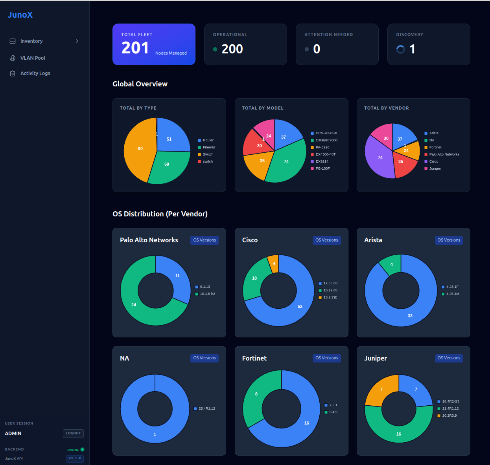
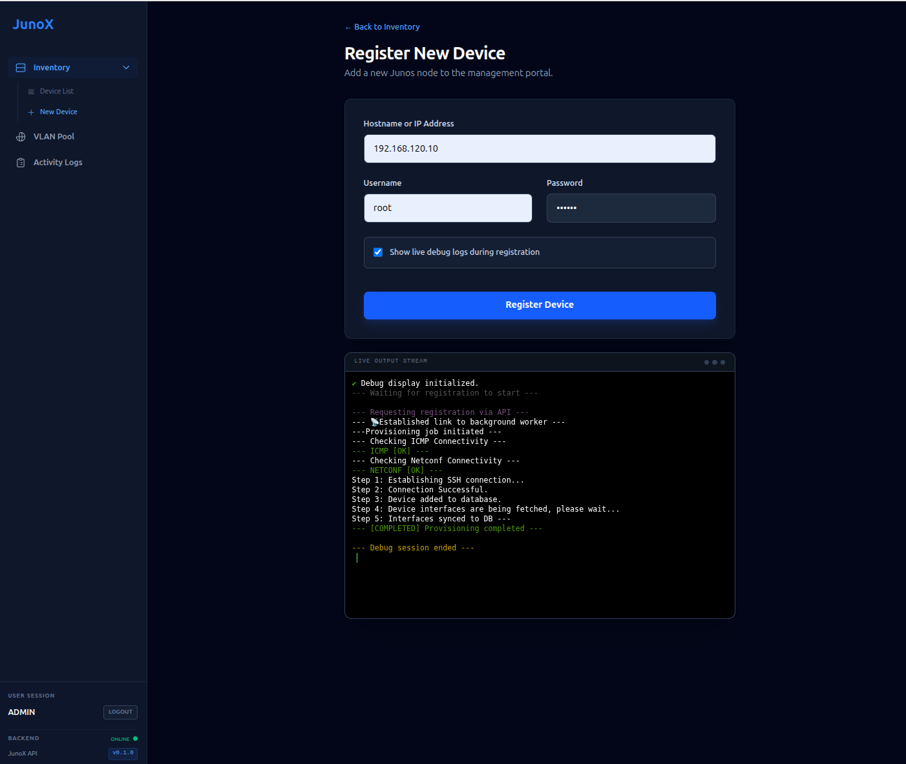
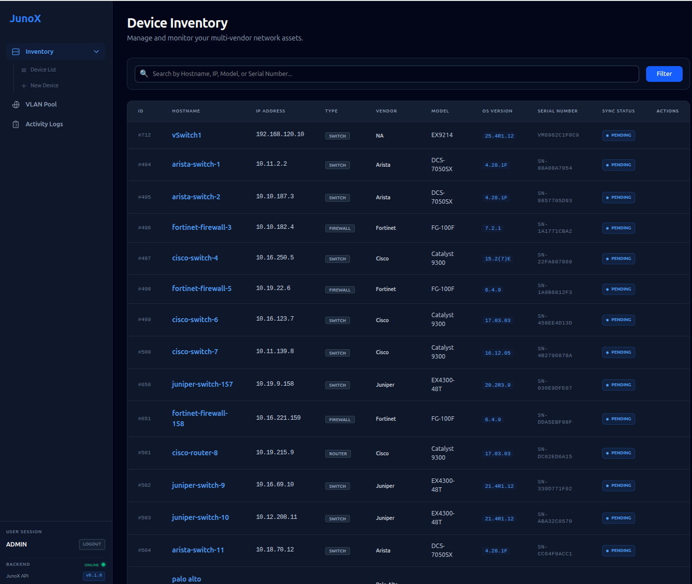
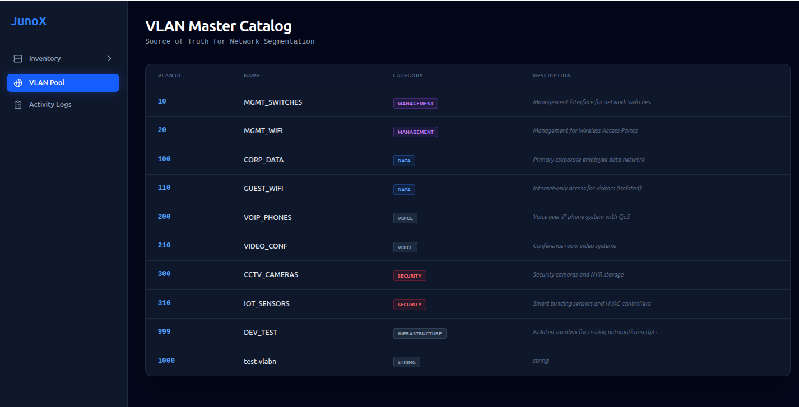
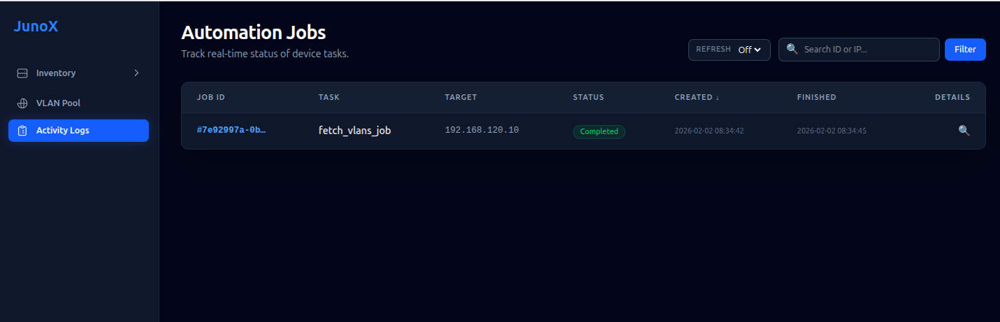

A Django frontend for Network Device Management

This project is a web-based interface for managing network devices. It allows users to add devices, fetch their configurations, and manage their interfaces and VLANs.

## Features

- Add devices to the database
- Fetch device configurations
- Manage interfaces
- Manage VLANs

## Frontend

- Django
- Tailwind CSS

## Backend

- FastAPI
- Juniper 
- Redis 
- RQ
- SQLAlchemy 
- PostgreSQL 

## Screenshots

    

